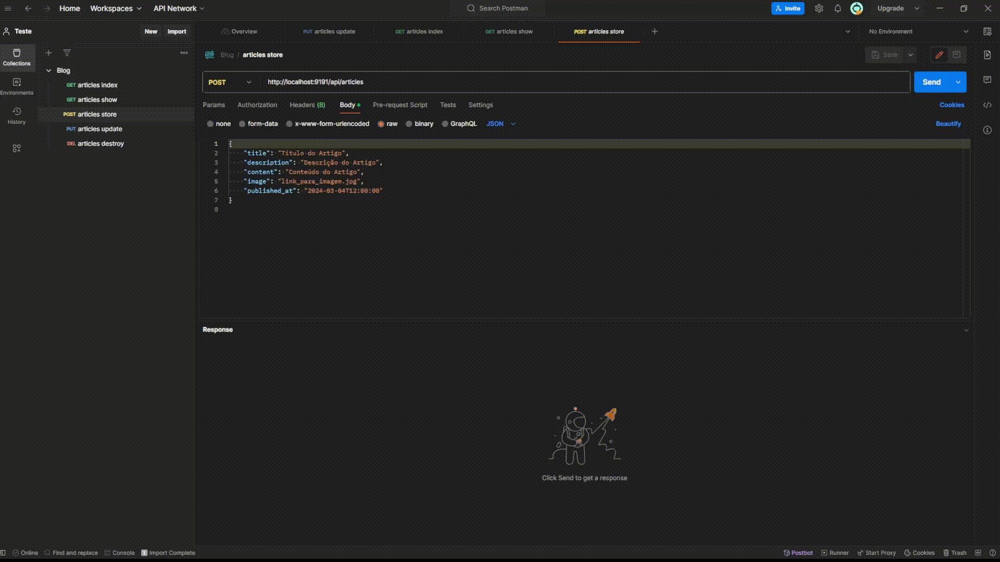

# Blog

Blog desenvolvido com laravel 10 e vue 3.

## Passo a passo


Certifique-se de ter instalado:

- docker engine;
- docker compose;
- node; 

Também certifique-se de ter as permissões de root ou admin.

Clone Repositório:

```sh
git clone -b dev https://github.com/wmikael/blog-laravel-vue.git
```

Acesse o diretorio do projeto:

```sh
cd blog-laravel-vue
```


### Executar a API:

Acesse a pasta da api:

```sh
cd portal-noticias-api
```

Execute o docker compose:

```
docker compose up -d
```

Execute o bash da aplicação de dentro do container:

```
docker compose exec app bash
```

Dentro do bash da aplicação:

```
composer install
```

```
php artisan key:generate
```

```
php artisan migrate
```

```
php artisan db:seed --class=ArticleSeeder
```

Depois disso, nas proximas execuções pode ser apenas: 

```
docker compose -up -d
```

OBS: lembre de executar esse compose dentro da pasta /portal-noticias-api


### Executar o FRONT:

Acessar a pasta do front:

OBS: Caso ainda esteja no mesmo terminal e na pasta da API:
```
cd ../portal-noticias-front
```
Em seguida instale as depencias com:

```
npm i
```
Após instalar as dependencias:

```
npm run dev
```

## Front

- Desenvolvido em Vue 3 composition api;
- Utiliza a biblioteca de componentes Naive.ui;

[http://localhost:8080](http://localhost:8080)


O front basicamente consome apenas o método index na pagina inicial, onde lista cards de materias com informacoes resumidas de forma paginada e ao usuario clicar em um card de materia, é redirecionado pra pagina da materia onde o método show é consumido, mostrando todas as informaçoes da materia.

## API

- Desenvolvida em Laravel 10;
- CRUD - Article (matéria);

### Métodos:

#### index: GET <http://localhost:9191/api/articles>


Retorna lista paginada de materias sem o conteudo da materia.

<hr/>

#### store: POST <http://localhost:9191/api/articles>



Ao passar um body como:

```
{
    "title": "Título do Artigo",
    "description": "Descrição do Artigo",
    "content": "Conteúdo do Artigo",
    "image": "link_para_imagem.jpg",
    "published_at": "2024-03-04T12:00:00"
}
```

Efetua o cadastro da materia

<hr/>

#### show: GET <http://localhost:9191/api/articles/{id}>


Ao passar um id, retorna as informacoes completas da materia.

<hr/>

#### update: PUT <http://localhost:9191/api/articles/{id}>

<!--  -->

Ao passar um id e um body com os campos alterados da materia, atualiza a materia e retorna ela atualizada.

<hr/>

#### destroy: DELETE <http://localhost:9191/api/articles/{id}>


Ao passar um id apaga a materia.

<hr/>


